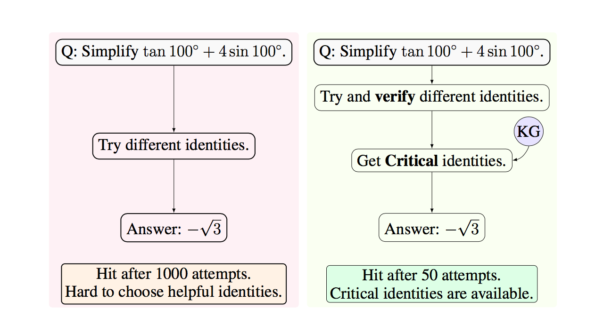

# SSC-CoT 
The code is for paper [Stepwise Self-Consistent Mathematical Reasoning with Large Language Models](https://arxiv.org/pdf/2402.17786.pdf). 




## Prerequisite

SSC-CoT requires Python version >= 3.9, we have need the library versions to be:
```
openai==0.27.7
Levenshtein==0.23.0
```

## SSC-CoT quickstart  
Follow the python notebook `SSC-CoT-on-Trimaster100.ipynb` for a training example on Trimaster100 dataset. The Trimaster100 dataset is also provided within the file.

